## Mermaid란?

Mermaid는 마크다운 문법을 사용하여 텍스트 기반으로 다이어그램을 생성할 수 있는 JavaScript 라이브러리입니다.  
마우스로 그래픽 툴을 사용하지 않고도 코드만으로 전문적인 다이어그램을 작성할 수 있어, 문서화 작업의 생산성을 크게 향상시킬 수 있습니다.  

### Mermaid의 장점

- **텍스트 기반 작성**: 코드로 다이어그램을 작성하므로 버전 관리가 용이
- **다양한 다이어그램 지원**: 플로우차트, 시퀀스 다이어그램, 간트 차트 등 11가지 이상의 다이어그램 타입 제공
- **쉬운 유지보수**: 수정이 간단하고 재사용성이 높음
- **광범위한 지원**: GitHub, GitLab, VS Code, Notion 등 다양한 플랫폼에서 사용 가능
- **직관적인 문법**: 수도 코드처럼 읽기 쉬운 구조로 흐름 파악이 용이

## VS Code에서 Mermaid 설정하기

### 1단계: 확장 프로그램 설치

VS Code의 Extension Marketplace에서 **"Markdown Preview Mermaid Support"** 확장 프로그램을 설치합니다.  

### 2단계: 마크다운 파일 작성

`.md` 확장자의 마크다운 파일을 생성하고 Mermaid 코드를 작성합니다.  

```markdown
​```mermaid
graph TD;
    A[시작] --> B[처리];
    B --> C{조건};
    C -->|Yes| D[완료];
    C -->|No| E[재시도];
​```
```

### 3단계: 미리보기 확인

파일에서 우클릭 후 **"Open Preview"**를 선택하면 다이어그램이 시각화되어 표시됩니다.  

## 지원하는 다이어그램 종류

Mermaid는 다양한 용도의 다이어그램을 지원합니다.  

### 1. Flowchart (플로우차트)

프로세스의 흐름을 시각화하는 가장 기본적인 다이어그램입니다.  

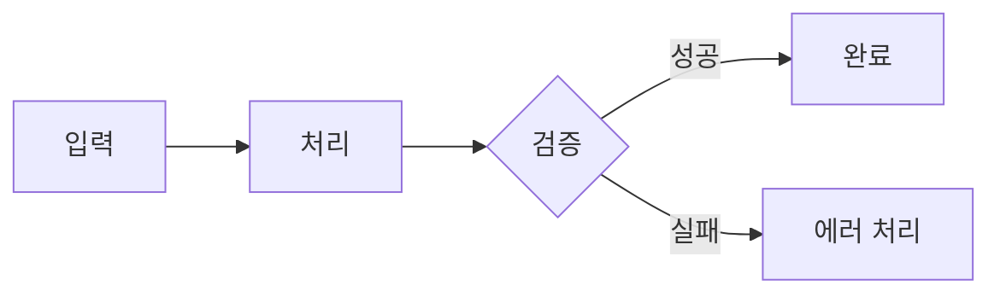

### 2. Sequence Diagram (시퀀스 다이어그램)

시스템 간의 상호작용과 메시지 흐름을 시간 순서대로 표현합니다.  

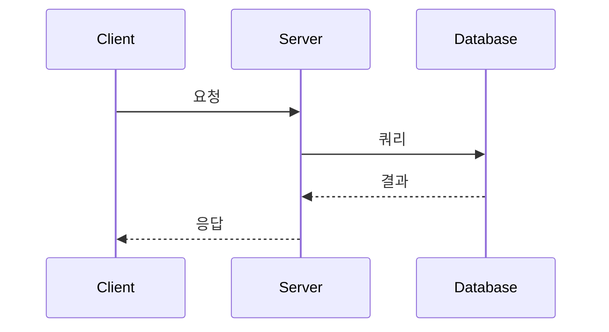

### 3. Class Diagram (클래스 다이어그램)

객체 지향 시스템의 클래스 구조와 관계를 UML 형식으로 표현합니다.    

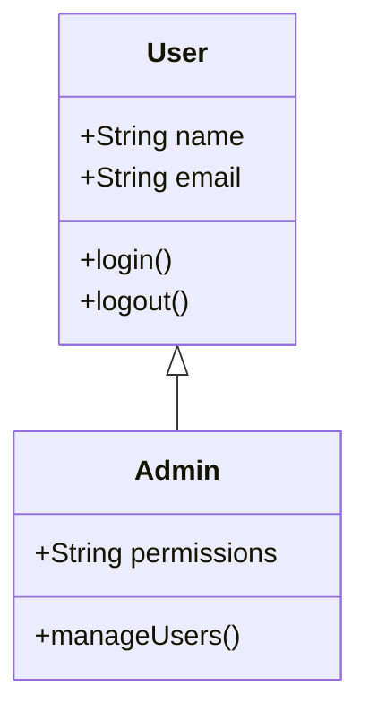

### 4. State Diagram (상태 다이어그램)

시스템의 상태 전이를 표현합니다.  

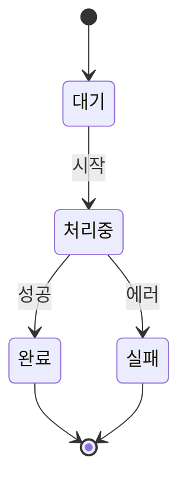

### 5. Entity Relationship Diagram (ERD)

데이터베이스의 엔티티와 관계를 표현합니다.  

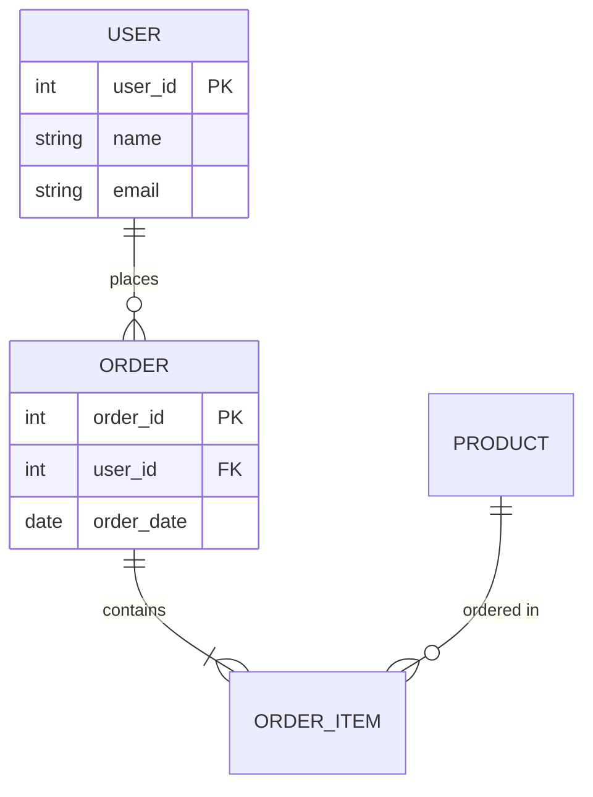

### 6. Gantt Chart (간트 차트)

프로젝트 일정과 작업 간의 의존성을 시각화합니다.  
 
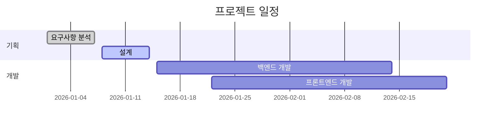

### 7. User Journey (사용자 여정)

사용자가 시스템을 사용하는 과정을 단계별로 표현합니다.  

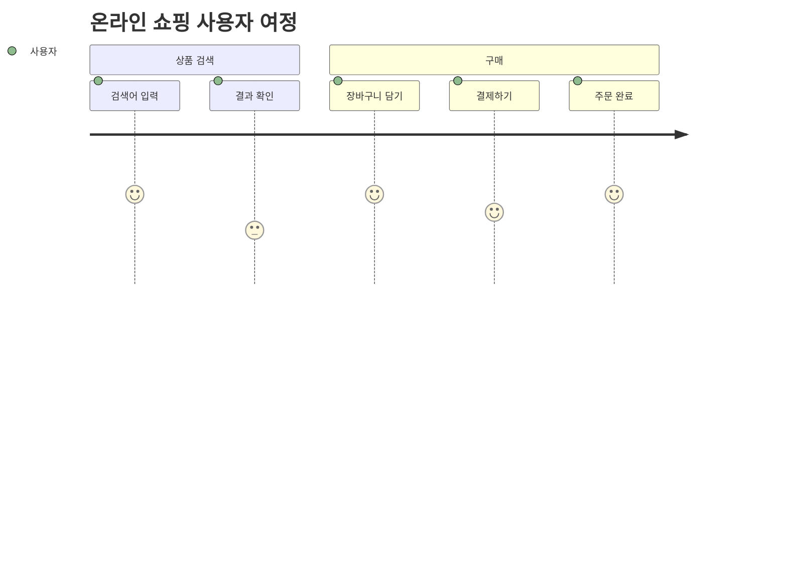

### 8. Git Diagram (Git 다이어그램)

Git의 브랜치와 커밋 히스토리를 시각화합니다.  

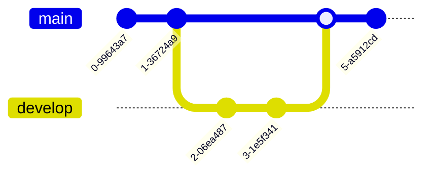

### 9. Pie Chart (파이 차트)

데이터의 비율을 원형 차트로 표현합니다.  

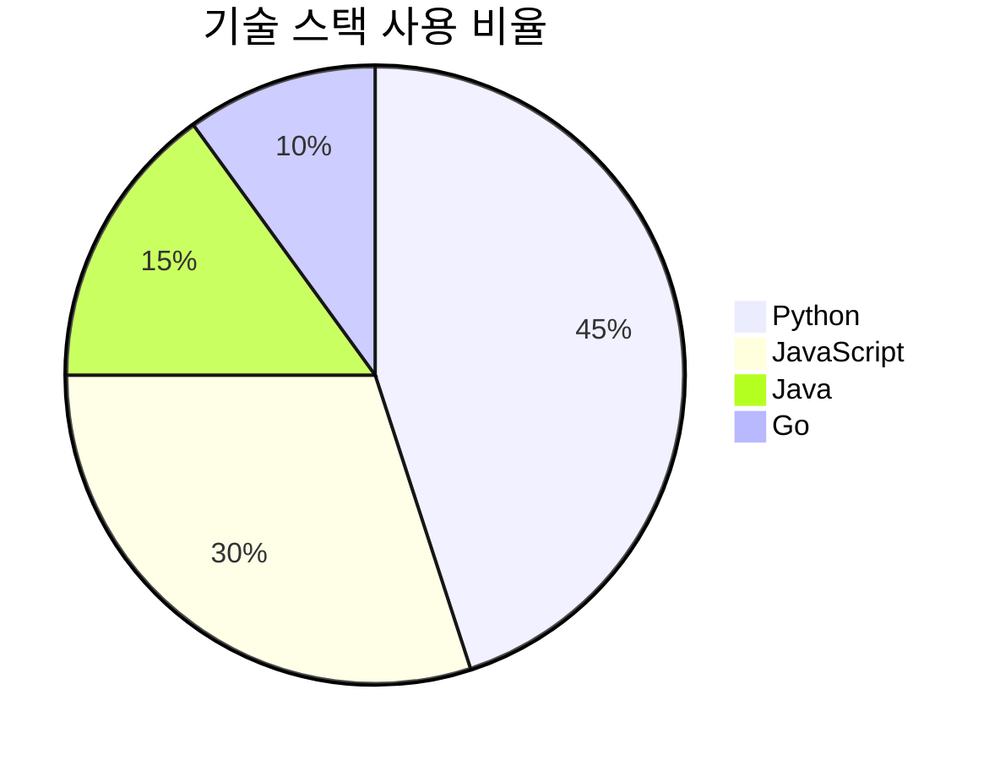

### 10. Requirement Diagram (요구사항 다이어그램)

시스템 요구사항과 그 관계를 표현합니다.  

```mermaid
requirementDiagram
    requirement 사용자_인증 {
        id: 1
        text: 사용자는 이메일과 비밀번호로 로그인할 수 있어야 한다
        risk: high
        verifymethod: test
    }

    element 로그인_시스템 {
        type: system
    }

    사용자_인증 - satisfies -> 로그인_시스템
```

### 11. C4 Diagram (C4 아키텍처 다이어그램)

시스템 아키텍처를 계층적으로 표현합니다.  

## Flowchart 심화 가이드

Flowchart는 Mermaid에서 가장 많이 사용되는 다이어그램 타입입니다.
상세한 사용법을 알아보겠습니다.  

### 방향 지정

Flowchart의 방향을 지정할 수 있습니다.  

- `TB` 또는 `TD`: Top to Bottom (위에서 아래로, 기본값)
- `BT`: Bottom to Top (아래에서 위로)
- `LR`: Left to Right (왼쪽에서 오른쪽으로)
- `RL`: Right to Left (오른쪽에서 왼쪽으로)


### 노드 형태 (Node Shapes)

Mermaid는 다양한 노드 형태를 지원합니다.  

#### 기본 노드 형태





#### v11.3.0+ 추가된 노드 형태

Mermaid v11.3.0부터는 30개 이상의 새로운 노드 형태가 추가되었습니다.  

**데이터 저장 관련:**
- Database (데이터베이스)
- Disk Storage (디스크 저장소)
- Direct Access Storage (직접 접근 저장소)

**처리 관련:**
- Divided Process (분할 프로세스)
- Lined Process (라인 프로세스)
- Multi-process (다중 프로세스)

**문서 관련:**
- Document (문서)
- Lined Document (라인 문서)
- Multi-document (다중 문서)
- Tagged Document (태그 문서)

**의사결정/제어 관련:**
- Decision Diamond (의사결정 다이아몬드)
- Prepare Conditional (조건 준비)
- Loop Limit (루프 제한)

**입출력 관련:**
- Lean Right/Left (경사 오른쪽/왼쪽)
- Manual Input (수동 입력)
- Data Input/Output (데이터 입출력)

**특수 형태:**
- Cloud (클라우드)
- Collate/Hourglass (모래시계)
- Fork/Join (분기/합류)
- Comment (주석)

### 간선 표현 (Edge/Arrow)

노드 간의 연결을 다양하게 표현할 수 있습니다.  


### 실전 예제: 전자상거래 구매 프로세스

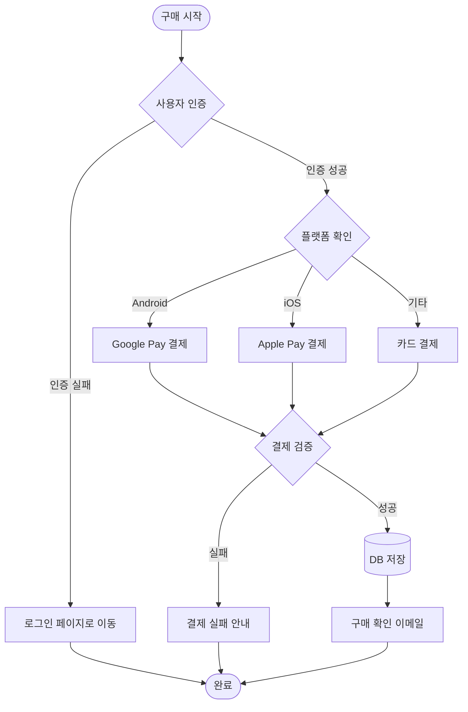

## Mermaid CLI로 SVG 변환하기

Mermaid 다이어그램을 SVG 이미지 파일로 변환할 수 있습니다.  

### Mermaid CLI 설치

```bash
npm install -g @mermaid-js/mermaid-cli
```

### SVG 변환 명령어

```bash
# 마크다운 파일의 Mermaid 코드를 SVG로 변환
mmdc -i diagram.md -o diagram.svg

# 직접 Mermaid 파일(.mmd)을 SVG로 변환
mmdc -i flowchart.mmd -o flowchart.svg

# PNG로 변환
mmdc -i diagram.md -o diagram.png

# PDF로 변환
mmdc -i diagram.md -o diagram.pdf
```

### 변환 옵션

```bash
# 테마 지정
mmdc -i input.md -o output.svg -t dark

# 배경색 지정
mmdc -i input.md -o output.svg -b transparent

# 크기 조정
mmdc -i input.md -o output.svg -w 1920 -H 1080
```

## 실무 활용 예제

### API 흐름 다이어그램

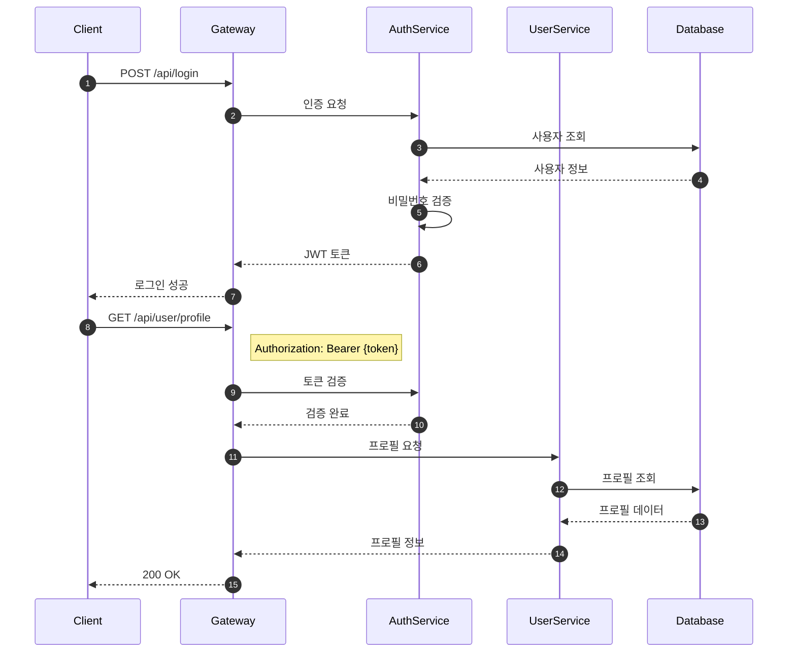

### 마이크로서비스 아키텍처

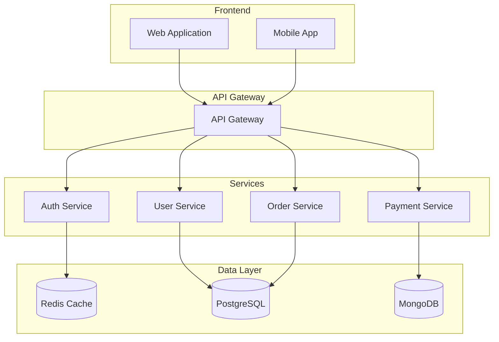

### 배포 파이프라인

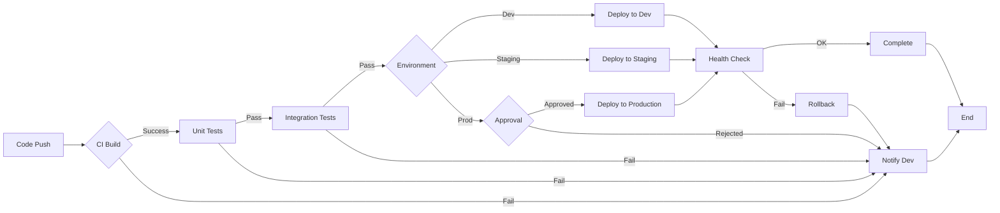

## 마치며

Mermaid는 개발 문서화에서 필수적인 도구가 되어가고 있습니다.  
텍스트 기반으로 다이어그램을 작성할 수 있어 버전 관리가 쉽고, Git과 같은 협업 도구와 완벽하게 통합됩니다.  

특히 다음과 같은 상황에서 Mermaid가 유용합니다:  

- **기술 문서 작성**: README, Wiki, 프로젝트 문서
- **아키텍처 설계**: 시스템 구조 및 데이터 플로우
- **프로세스 정의**: 업무 흐름, 배포 파이프라인
- **교육 자료**: 개념 설명, 튜토리얼

Mermaid 공식 문서(https://mermaid.js.org/){:target="_blank"}에서 더 자세한 문법과 예제를 확인할 수 있습니다.  

## 참고 자료

- [Mermaid 공식 문서](https://mermaid.js.org/)
- [Mermaid Live Editor](https://mermaid.live/) - 온라인 에디터로 실시간 테스트
- [Mermaid GitHub](https://github.com/mermaid-js/mermaid)
- [Mermaid CLI](https://github.com/mermaid-js/mermaid-cli)
